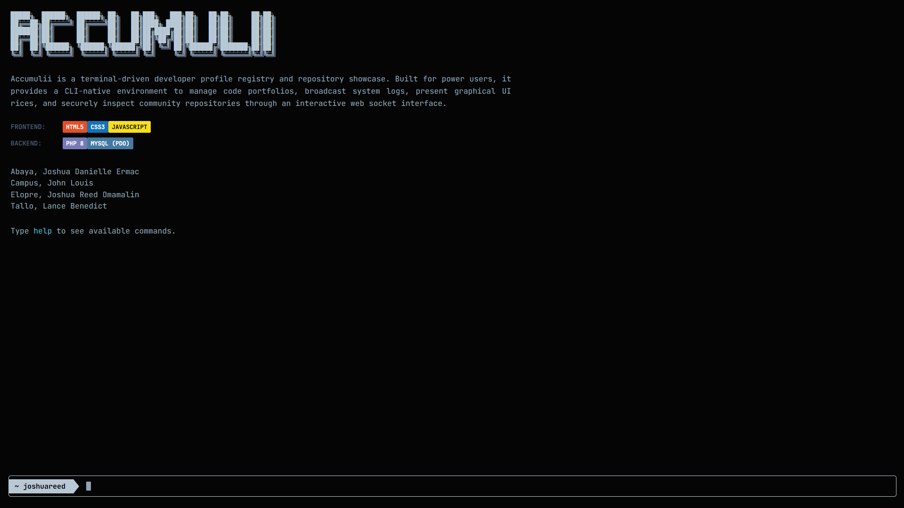

<div align="center">

  # ▀▄▀▄▀▄ Accumulii ▄▀▄▀▄▀

  **TERMINAL // REPOSITORY // CLI AESTHETIC // COMMUNITY**



</div>

*In Partial Fulfillment of the Requirements for Web Development 1*

Accumulii is a terminal-driven developer profile registry and repository showcase. It provides a CLI-native web environment for managing code portfolios, broadcasting system logs, presenting graphical UI rices, and inspecting community repositories — all through an interactive terminal interface running in the browser.

---

## Project Structure

```plaintext
Accumulii/
├── css/
│   ├── style.css         # Core terminal layout, design tokens, and all component styles
│   └── theme.css         # Theme overrides (dark, ash, white) via CSS custom properties
├── js/
│   ├── api.js            # Fetch wrapper — sends POST requests to api.php
│   └── commands.js       # Command parser, all command handlers, and repo keybind logic
├── img/
│   ├── profiles/         # User profile images (named by username, e.g. joshuareed.jpg)
│   └── showcases/        # Showcase images referenced by the showcases table
├── index.php             # Main terminal interface and keyboard input loop
├── login.php             # Authentication gate with animated boot sequence
├── register.php          # New user registration with multi-step prompt flow
├── api.php               # REST-style POST endpoint handling all terminal commands
├── config.php            # PDO database connection, session bootstrap, and auth helpers
└── database.sql          # Full schema with seed data (users, repos, showcases)
```

---

## Tech Stack

| Layer     | Technology              |
|-----------|-------------------------|
| Frontend  | HTML5, CSS3, JavaScript |
| Backend   | PHP 8                   |
| Database  | MySQL via PDO           |
| Font      | JetBrains Mono (Google Fonts) |

---

## Command Reference

### Navigation

| Command   | Description                                          |
|-----------|------------------------------------------------------|
| `help`    | Display the full command reference                   |
| `clear`   | Clear the terminal output buffer                     |
| `whoami`  | Print the active session username                    |
| `logout`  | Terminate the session and return to the auth gate    |

### Profile & Configuration

| Command                      | Description                                                              |
|------------------------------|--------------------------------------------------------------------------|
| `fetchme`                    | Display project info and developer credits in a Fastfetch-style layout   |
| `profile <user>`             | Fetch a user's profile card from the registry                            |
| `set <key> "<value>"`        | Update a profile field. Allowed keys: `bio`, `university`, `course`, `year` |
| `restore defts`              | Factory reset — wipes bio and posts, restores default theme and education fields |

### System Log

| Command          | Description                                              |
|------------------|----------------------------------------------------------|
| `post "<msg>"`   | Broadcast a message to the public system log             |
| `log`            | View all entries in the public system broadcast log      |

### Repositories

| Command                       | Description                                              |
|-------------------------------|----------------------------------------------------------|
| `repos`                       | List all repositories across the registry                |
| `repos <user>`                | List repositories belonging to a specific user           |
| `searchrepo <query>`          | Search repository names and descriptions                 |
| `repo <name> [name2 ...]`     | Inspect one or more repositories side-by-side. Press `q` to download a clone stub, `Esc` to dismiss |

### Media & Showcases

| Command            | Description                                              |
|--------------------|----------------------------------------------------------|
| `showcases`        | List all visual showcases in the registry                |
| `showcase <name>`  | View a showcase image at full resolution with metadata   |

### Display

| Command          | Description                                              |
|------------------|----------------------------------------------------------|
| `online`         | Show currently online system instances                   |
| `theme <name>`   | Switch terminal theme — `dark`, `ash`, or `white`        |

---

## Database Schema

Four tables make up the schema. The `database.sql` file creates them and inserts the seed data in one shot.

| Table              | Purpose                                                    |
|--------------------|------------------------------------------------------------|
| `users`            | Accounts, profile fields (bio, university, course, year), theme preference |
| `repositories`     | Repos linked to a user — name, description, language, stars |
| `profile_comments` | Public broadcast log entries                               |
| `showcases`        | Image showcase entries linked to a user                    |

Default seed password for all pre-loaded accounts is `password`.

---

## Running Locally with XAMPP

### Prerequisites

- [XAMPP](https://www.apachefriends.org/) with **Apache** and **MySQL** enabled
- A browser (the terminal UI is purely web-based, no build step required)

### 1 — Start XAMPP

Open the **XAMPP Control Panel** and start both the **Apache** and **MySQL** modules. Both status indicators should turn green before continuing.

### 2 — Place the project files

Copy the entire `Accumulii/` folder into your XAMPP `htdocs` directory:

```
C:\xampp\htdocs\Accumulii\      ← Windows
/Applications/XAMPP/htdocs/Accumulii/   ← macOS
/opt/lampp/htdocs/Accumulii/    ← Linux
```

### 3 — Import the database

1. Open your browser and go to `http://localhost/phpmyadmin`
2. Click **New** in the left sidebar and create a database named `accumulii`
3. Select the `accumulii` database, then click the **Import** tab
4. Click **Choose File**, select `Accumulii/database.sql`, and click **Import**

The schema and all seed data (users, repositories, showcases) will be loaded automatically.

### 4 — Verify the database connection

Open `config.php` and confirm the credentials match your XAMPP setup. The defaults work for a standard XAMPP install with no root password:

```php
$host     = 'localhost';
$dbname   = 'accumulii';
$username = 'root';
$password = '';        // leave blank for default XAMPP MySQL
```

If you have set a MySQL root password in phpMyAdmin, enter it here.

### 5 — Open the application

Navigate to:

```
http://localhost/accumulii/
```

You will be redirected to the login page. Use any of the pre-seeded accounts:

| Username     | Password   | Role                    |
|--------------|------------|-------------------------|
| `joshuareed` | `password` | Lead Full-Stack Engineer |
| `lancer`     | `password` | Backend Engineer        |
| `john`       | `password` | Database Administrator  |
| `joshuadan`  | `password` | Frontend Developer      |

Or type `register` at the login prompt to create a new account.

---

## Developers

| Name                        |
|-----------------------------|
| Abaya, Joshua Danielle Ermac |
| Campus, John Louis          |
| Elopre, Joshua Reed Omamalin |
| Tallo, Lance Benedict       |
